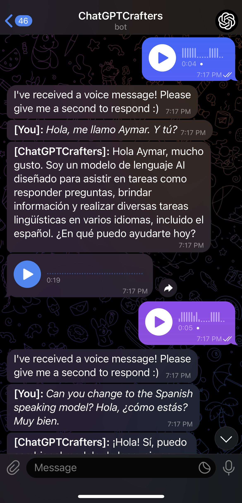

# ChatGPTCrafters - Your Customizable, Multilingual Personal Mobile Assistant

In recent years, OpenAI's GPT-3 has revolutionized the world of AI, offering human-like text generation that can be used in a multitude of applications. Among these, personal AI assistants have shown great potential in tasks ranging from scheduling meetings to answering queries with human-like understanding and fluency.

Inspired by these technological advances, I decided to build my own personal AI assistant, which I named ChatGPTCrafters. This project allowed me to have my own AI assistant on my mobile device via Telegram, a cloud-based instant messaging app. The intention was to create a personal assistant that can hold meaningful conversations, provide insightful responses, and be easily accessible through my mobile device.

ChatGPTCrafters listens to my text and voice messages, transcribes them, and uses GPT-3 to generate responses. It then delivers these responses back to me both in text and as an audio message. The audio messages are generated using the Eleven Labs Text-to-Speech API, providing a pleasant and engaging conversational experience.

A unique feature of ChatGPTCrafters is its ability to clone the voices of various celebrities using Eleven Labs' voice cloning technology. This means that my AI assistant can speak to me in the voices of famous personalities like Barack Obama, Donald Trump, Kanye West, Tom Holland, and many others. This feature adds a fun and personalized touch to my interactions with the chatbot.

Moreover, ChatGPTCrafters boasts impressive multilingual capabilities. It can understand and generate text in multiple languages, and can deliver its responses in a variety of languages, too. This is made possible by the Eleven Labs' Text-to-Speech API, enabling my AI assistant to communicate with me in the language of my choice, with accurate pronunciation and natural intonation.

I have chosen to host this project on PythonAnywhere, a cloud-based Python development and hosting environment. This ensures that my bot can run 24/7, ready to interact with me at any time of the day.

An additional layer of security has been added to protect sensitive data. Incoming and outgoing messages are encrypted and decrypted on-the-fly using Python's cryptography library, providing an extra layer of security and privacy for the user's data.

While I built ChatGPTCrafters for my personal use, the code is open to anyone who would like to create a similar tool for themselves. One of the great things about ChatGPTCrafters is that it can be customized to fit your unique needs. By adjusting the prompts in the code, you can tailor your AI assistant to perform a wide range of tasks.

Please note that to create your own version of ChatGPTCrafters, you will need access to the OpenAI API and the Eleven Labs API. These services are not free and come with their own pricing, so please ensure you are aware of the costs involved before using this project.

To get started with creating your own AI assistant like ChatGPTCrafters, you'll need to set up your OpenAI, Eleven Labs, and Telegram API keys. After that, you can start conversing with your new AI companion in the voice of your choice!

This project is a testament to the rapid advances in AI technology and its potential to improve our daily lives. It's a step towards making AI companions more accessible, engaging, and personalized to everyone's tastes. I hope that ChatGPTCrafters can inspire you to explore the possibilities of AI and create your own personal AI assistant.

Just replace "YOUR_OPENAI_API_KEY_HERE", "YOUR_ELEVEN_LABS_API_KEY_HERE", and "YOUR_TELEGRAM_API_TOKEN_HERE" with your actual API keys and token.

## Installation

To get started with this project, follow the steps below:

1. Clone this repository to your local machine.
2. Install the necessary Python libraries by running the command: `pip install -r requirements.txt`.
3. You'll need to replace "YOUR_OPENAI_API_KEY_HERE", "YOUR_ELEVEN_LABS_API_KEY_HERE", and "YOUR_TELEGRAM_API_TOKEN_HERE" with your actual API keys and token in the `chatgpt-telegram-voice-chatbot.py` file.

## Running the bot

1. Run the bot by executing the python script: `python chatgpt-telegram-voice-chatbot.py`. This will start the bot, and it will begin listening for incoming messages on Telegram.
2. When you send a message to the bot on Telegram, it will process the message, generate a response using OpenAI's GPT-3 model, and send a text and audio response back to you.
3. If you need to stop the bot, you can simply interrupt the script execution with `Ctrl+C`.

Remember, you need to have access to OpenAI API, Eleven Labs API, and a Telegram bot token to make this bot work. Also, be aware that the APIs used in this project are not free and come with their own pricing. Make sure you are aware of the costs involved before using this project.

## Hosting the bot

You can host the bot locally, or on a cloud hosting platform like PythonAnywhere. If you choose to host the bot on a cloud platform, make sure the platform supports long-running processes, as the bot needs to be running continuously to listen for and respond to messages.

## Demo

Check out these demo videos to see ChatGPTCrafters in action!

1. [ChatGPTCrafters Demo: Multilingual Text-to-Speech](https://www.youtube.com/shorts/N2zGGnI309E)
2. [ChatGPTCrafters Demo: Generating a Workout Routine](https://www.youtube.com/shorts/nw5coMEZZC0)
